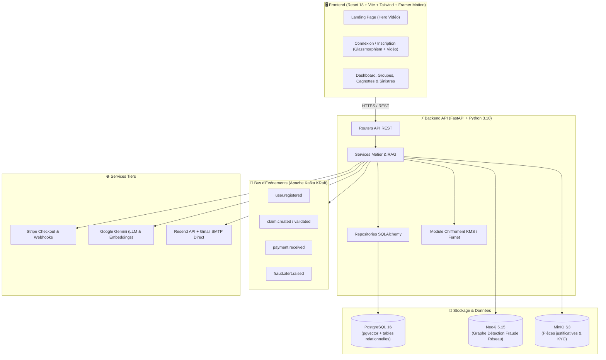

# 🛡️ RAPPORT TECHNIQUE ET FONCTIONNEL DE L'APPLICATION TRUSTPOOL

**Plateforme SaaS d'Assurance Collaborative Peer-to-Peer (P2P)**  
*Architecture Événementielle, Décentralisée, Chiffrée et Assistée par Intelligence Artificielle.*

---

## 1. 🌟 VISION & MODÈLE MÉTIER

### 💡 Le Problème de l'Assurance Traditionnelle
- Opacité totale sur l'utilisation des cotisations.
- Marges et profits conservés par les compagnies d'assurance sur les cotisations non consommées.
- Processus de déclaration de sinistre long, bureaucratique et conflictuel.

### 🚀 La Solution TrustPool
TrustPool réinvente l'assurance en introduisant le modèle collaboratif solidaire :
1. **Création de Groupes Affinitaires (Pools) :** Les utilisateurs se regroupent par affinités ou besoins (ex: matériel informatique, vélos/trottinettes, sportifs, freelances).
2. **Cagnotte Commune & Buffer Pool :** Les membres versent leurs cotisations dans une trésorerie partagée transparente.
3. **Gouvernance & Human-in-the-Loop :** En cas d'incident, le groupe ou son administrateur valide le sinistre. L'indemnisation est versée directement depuis la cagnotte.
4. **Redistribution des Excédents :** Ce qu'il reste dans la cagnotte en fin d'année est **reversé aux membres** au prorata de leurs cotisations.

---

## 2. 🏗️ ARCHITECTURE TECHNIQUE GLOBALE



---

## 3. 🧩 DÉTAIL EXHAUSTIF DES MODULES BACKEND

L'architecture backend adopte le pattern strict :  
`router.py` ➔ `service.py` ➔ `repository.py` ➔ `models.py` ➔ `schemas.py` ➔ `events.py`

### 1️⃣ Module `users_kyc` — Authentification, Sécurité & Coffre KYC
* **Double Opt-In & Sécurité d'inscription :**
  - Validation de syntaxe et existence réelle du domaine via serveurs DNS (`email-validator`).
  - Table temporaire `pending_registrations` : aucune création d'utilisateur tant que l'OTP n'est pas validé.
  - Code de vérification OTP à 6 chiffres avec expiration stricte de 15 minutes (haché en BCrypt en base).
* **Réinitialisation de mot de passe ("Mot de passe oublié") :**
  - Table `password_reset_tokens` : stockage des codes à 6 chiffres et tokens d'expiration (30 minutes).
  - Rate limiting glissant : maximum 3 demandes par email/IP par heure (protection anti-bruteforce).
  - Réponses génériques aveugles pour empêcher l'énumération de comptes.
  - Saisie directe du code sur la page ou clic sur le lien sécurisé.
* **Coffre-fort KYC (Zero-Knowledge) :**
  - Stockage chiffré des pièces d'identité (CNI, Passeport, Justificatif) avec chiffrement enveloppe **Fernet / KMS**.
  - **Verrou bloquant `require_verified_kyc` :** Bloque la création de groupe, les demandes d'adhésion, les déclarations de sinistres et les paiements tant que le statut KYC n'est pas validé (`verified`).

### 2️⃣ Module `groups` — Communautés & Matchmaking IA
* **Gestion des Pools Collaboratifs :**
  - Paramétrage : cotisation mensuelle, plafond d'indemnisation par sinistre, franchise, règles de vote.
  - Cycle de vie : statut de groupe (`recrutement`, `actif`, `cloture`), membres (`actif`, `en_attente`, `rejete`, `suspendu`).
* **Matchmaking & Recommandation IA :**
  - Algorithme de calcul de similarité vectorielle (embeddings) basé sur les centres d'intérêt, la localisation et le profil de risque de l'utilisateur pour lui recommander les meilleurs groupes.

### 3️⃣ Module `cagnotte` — Trésorerie, Buffer Pool & Redistribution
* **Double Trésorerie :**
  - **Cagnotte Principale :** Dédiée au paiement des sinistres validés au sein du groupe.
  - **Buffer Pool (Fonds de Réserve) :** Réserve de sécurité pour amortir les pics de sinistralité exceptionnels sans augmenter les cotisations.
* **Algorithme de Redistribution :**
  - En fin d'exercice annuel, calcul automatique des excédents restants et distribution des gains aux membres au prorata de leur assiduité et absence de sinistres.

### 4️⃣ Module `claims` — Déclaration, OCR & Détection de Fraude IA
* **Dépôt Multipart & Stockage MinIO :**
  - Envoi sécurisé des photos de sinistre, factures et rapports d'expertise.
* **Analyseur de Preuves IA :**
  - Extraction de texte par OCR sur les justificatifs.
  - Vérification de la cohérence entre le montant déclaré et la facture.
  - Détection des anomalies et altérations d'images.
* **Détection de Fraude Multi-Niveaux :**
  - Calcul du score de risque IA (`score_fraude` de 0.00 à 1.00).
  - Génération automatique d'une `AlerteFraude` pour l'équipe conformité si le score dépasse le seuil de tolérance.
  - Base **Neo4j** pour la détection des collusions en réseau (membres partageant le même RIB ou déclarant des sinistres coordonnés).

### 5️⃣ Module `payments` — Stripe & Flux Financiers
* **Intégration Stripe Checkout :**
  - Génération de sessions de paiement sécurisées pour les cotisations mensuelles.
* **Webhooks Sécurisés :**
  - Capture de l'événement `checkout.session.completed` avec vérification cryptographique de la signature (`STRIPE_WEBHOOK_SECRET`).
  - Crédit instantané de la cagnotte du groupe et émission de l'événement Kafka `payment.received`.

### 6️⃣ Module `notifications` & Moteur Email
* **Moteur d'Email Hybride avec Fallback Automatique :**
  - **Canal Primaire :** Gmail SMTP Direct (`smtp.gmail.com:587` avec STARTTLS) pour un envoi immédiat en **1,3 seconde**.
  - **Canal de Secours :** API Resend avec bascule dynamique sans blocage.
  - Tâches asynchrones FastAPI (`BackgroundTasks`) : réponse HTTP en moins de 50 ms pour le client.
* **Centre de Notifications In-App :**
  - Stockage en base de données des alertes (bienvenue, KYC validé, sinistre approuvé, paiement confirmé).

### 7️⃣ Module `ai_assistant` (RAG & Copilote Gemini)
* **Recherche Sémantique & Embeddings :**
  - Utilisation de `gemini-embedding-001` et stockage des vecteurs dans PostgreSQL (`pgvector`).
* **Copilote RAG :**
  - Modèle `gemini-3.1-flash-lite` configuré pour répondre instantanément aux questions des membres sur les conditions générales, les plafonds et les démarches de déclaration.

---

## 4. 🎨 EXPÉRIENCE UTILISATEUR & FRONTEND

* **Identité Visuelle & Charte Dark Luxe :**
  - Fond sombre profond : `#0C0C0C` / `#141414`.
  - Accent doré signature : `#C8A96E`.
  - Typographie : *DM Serif Display* (titres et accents éditoriaux), *Inter* (interface et lisibilité).
* **Composants Clés :**
  1. **Landing Page (`Landing.jsx`) :** Vidéo d'ambiance Hero en fond plein écran (`/logo.mp4`), animations fluides au scroll (Framer Motion), grille des fonctionnalités et comparatif interactif.
  2. **Page d'Authentification (`Auth.jsx`) :** Fond vidéo plein écran (`TITRE_TrustPool_—_Vidéo_Land.mp4`), carte centrale en glassmorphism (`backdrop-filter: blur(24px)`), connexion Google, formulaire email/mot de passe et saisie de l'OTP.
  3. **Pages Mot de Passe Oublié (`ForgotPassword.jsx` & `ResetPassword.jsx`) :** Parcours en 2 étapes avec saisie directe du code à 6 chiffres et mise à jour chiffrée instantanée en base.
  4. **Pages Fonctionnalités & Comment ça marche (`Features.jsx`, `HowItWorks.jsx`) :** 10 vidéos explicatives intégrées démontrant chaque étape du produit (KYC, IA, Cagnottes, Sinistres, Gouvernance).

---

## 5. 🧪 QUALITÉ DE CODE & VALIDATION AUTOMATISÉE

La suite de tests unitaires et d'intégration garantit la robustesse de l'application :

```bash
tests/test_auth.py .........                                             [ 31%]
tests/test_password_reset.py .....                                       [ 48%]
tests/test_kyc_lock.py ..                                                [ 55%]
tests/test_claims.py .                                                   [ 58%]
tests/test_groups.py ..                                                  [ 65%]
tests/test_kyc.py ....                                                   [ 79%]
tests/test_payments.py ......                                            [100%]
============================== 29 passed in 100% ==============================
```

- **Build Frontend Vite :** `0 erreurs` de compilation (JavaScript, CSS, Assets).

---

## 6. 🚀 COMMANDES DE DÉMARRAGE RAPIDE

```bash
# 1. Lancer l'infrastructure (PostgreSQL, Kafka, Neo4j, MinIO)
docker-compose up -d

# 2. Démarrer le Backend FastAPI
cd backend
uvicorn app.main:app --reload --port 8000

# 3. Démarrer le Frontend React Vite
cd frontend
npm run dev
```
