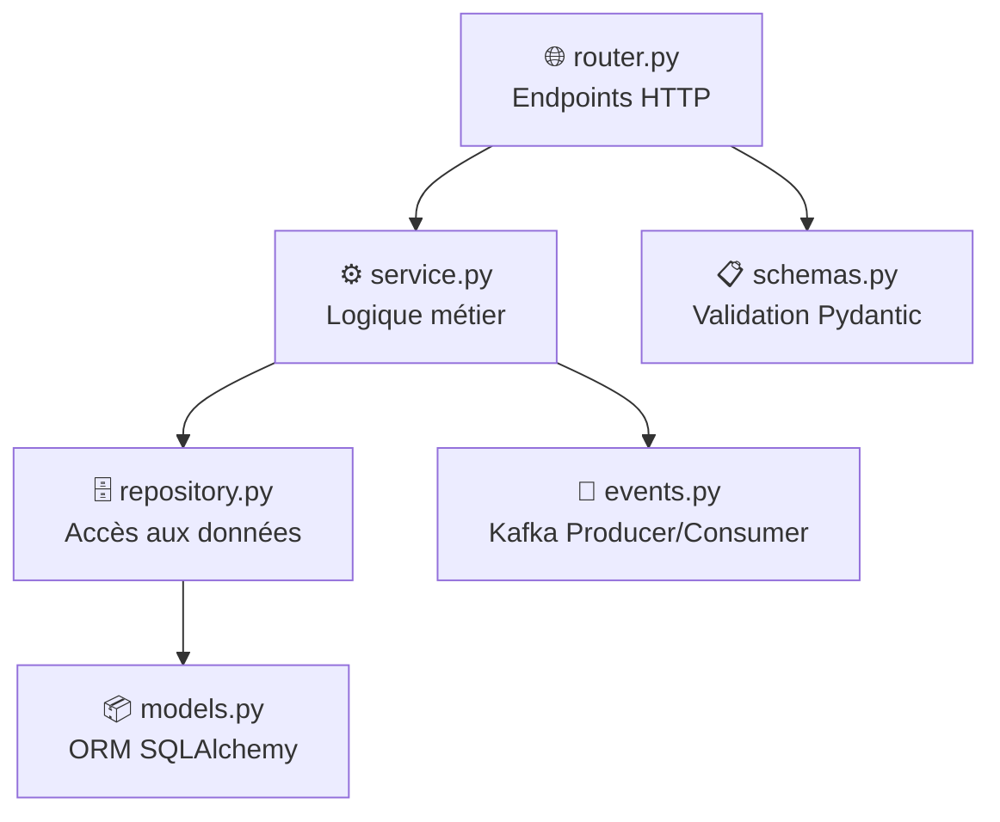
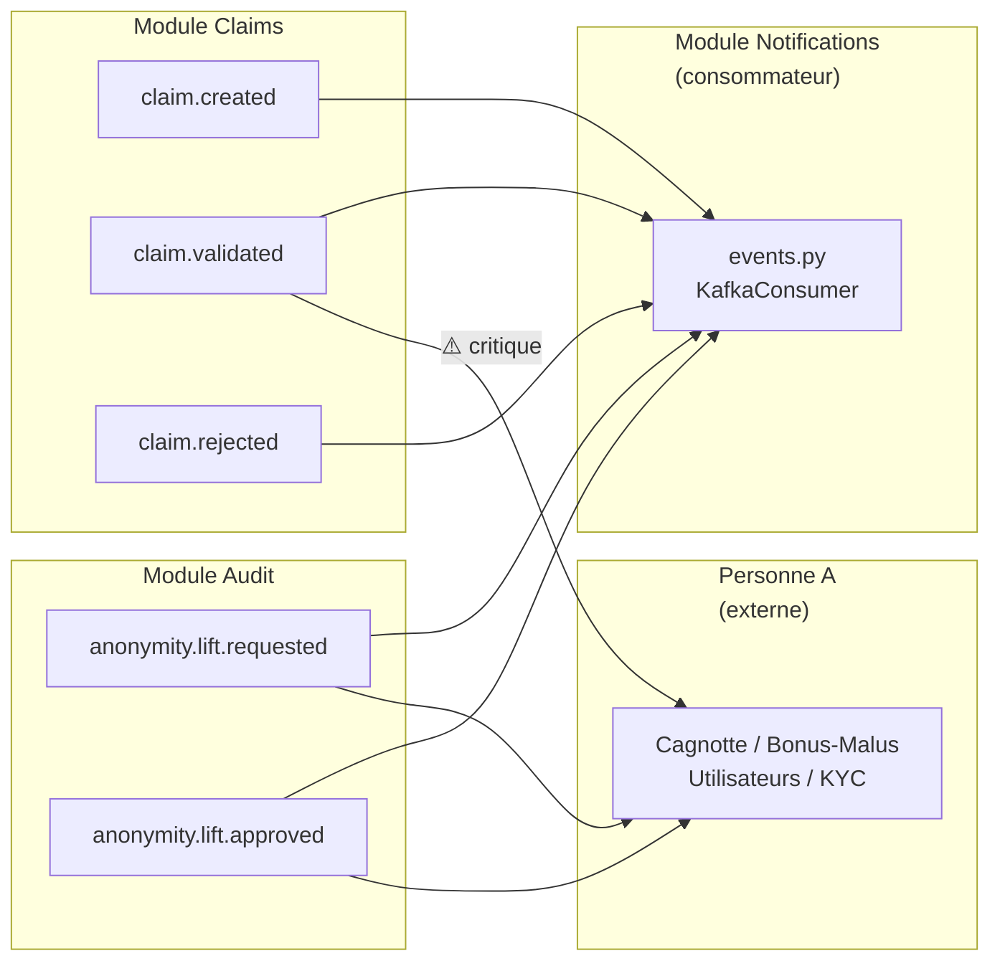

# 🏗️ Structure du Backend — Plateforme Assurance Collaborative P2P

## Vue d'ensemble

Le backend est une **API REST FastAPI** pour une plateforme d'assurance collaborative peer-to-peer. Il utilise **PostgreSQL** (avec pgvector) comme base de données, **Neo4j** pour la détection de fraude par graphe, et **Apache Kafka** comme bus d'événements entre modules.

### Architecture en couches par module

Chaque module métier suit un **pattern à 6 fichiers** identique :



| Couche | Rôle | Règle |
|--------|------|-------|
| `router.py` | Endpoints HTTP, validation, réponses | **Aucune logique métier** — uniquement du dispatch |
| `service.py` | Orchestration (repo + events + autres modules) | **Toute la logique métier** vit ici |
| `repository.py` | Requêtes SQLAlchemy (CRUD) | **Aucune logique métier** — que des requêtes |
| `events.py` | Production/consommation Kafka | Respecte le format `infra/kafka/events.md` |
| `models.py` | Tables PostgreSQL (ORM) | Correspond à `infra/init.sql` |
| `schemas.py` | Validation entrées/sorties API (Pydantic) | Séparé des models ORM |

---

## Arborescence complète

```
backend/
├── .env                          # Variables d'environnement (secrets, URLs)
├── app/
│   ├── __init__.py               # Package Python racine
│   ├── main.py                   # Point d'entrée FastAPI
│   ├── config.py                 # Configuration centralisée
│   ├── core/                     # Services partagés par tous les modules
│   │   ├── __init__.py
│   │   ├── auth.py               # Authentification JWT (tokens, rôles)
│   │   ├── database.py           # Connexion PostgreSQL (SQLAlchemy)
│   │   └── kafka_client.py       # Client Kafka partagé (producteur)
│   └── modules/                  # Modules métier
│       ├── __init__.py
│       ├── claims/               # Module Sinistres
│       │   ├── models.py
│       │   ├── schemas.py
│       │   ├── repository.py
│       │   ├── service.py
│       │   ├── router.py
│       │   └── events.py
│       ├── audit/                # Module Audit & Conformité
│       │   ├── models.py
│       │   ├── schemas.py
│       │   ├── repository.py
│       │   ├── service.py
│       │   ├── router.py
│       │   └── events.py
│       └── notifications/        # Module Notifications
│           ├── models.py
│           ├── schemas.py
│           ├── repository.py
│           ├── service.py
│           ├── router.py
│           └── events.py
```

---

## 📄 Fichiers Racine

### [.env](file:///home/ilyass/insurance-platform/backend/.env)
Variables d'environnement sensibles chargées au démarrage. Contient :
- `DATABASE_URL` — URL de connexion PostgreSQL
- `KAFKA_BOOTSTRAP_SERVERS` — Adresse du broker Kafka (`localhost:9094`)
- `FERNET_KEY` — Clé de chiffrement symétrique (pour les données KYC)
- `JWT_SECRET_KEY` — Clé secrète pour signer les JWT

---

## 📂 `app/` — Code source principal

### [main.py](file:///home/ilyass/insurance-platform/backend/app/main.py)
**Point d'entrée de l'API FastAPI.** C'est le fichier qui crée l'application et monte les routers.

**Ce qu'il fait :**
1. Charge les variables d'environnement depuis `.env` via `dotenv`
2. Crée l'instance `FastAPI` avec le titre "Plateforme Assurance Collaborative P2P"
3. Monte les 3 routers modules : `claims`, `notifications`, `audit`
4. Expose un endpoint `/health` pour les health checks

**Endpoints montés :**
- `/claims/...` — Gestion des sinistres
- `/notifications/...` — Notifications utilisateur
- `/audit/...` — Journal d'audit et levée d'anonymat

---

### [config.py](file:///home/ilyass/insurance-platform/backend/app/config.py)
**Configuration centralisée** lue depuis les variables d'environnement. Expose 4 constantes :
- `DATABASE_URL` — URL PostgreSQL
- `KAFKA_BOOTSTRAP_SERVERS` — Adresse Kafka
- `FERNET_KEY` — Clé de chiffrement
- `JWT_SECRET_KEY` — Clé JWT

> [!IMPORTANT]
> Ce fichier ne contient jamais de secret en dur. Tout est lu depuis `.env`.

---

## 📂 `app/core/` — Services partagés

Ce dossier contient les **composants transversaux** utilisés par tous les modules. Aucun module ne doit réécrire sa propre version de ces services.

### [database.py](file:///home/ilyass/insurance-platform/backend/app/core/database.py)
**Connexion PostgreSQL partagée via SQLAlchemy.**

**Ce qu'il fournit :**
- `engine` — Moteur SQLAlchemy connecté à PostgreSQL
- `SessionLocal` — Factory de sessions DB
- `Base` — Classe de base déclarative pour tous les modèles ORM
- `get_session()` — Dépendance FastAPI qui fournit une session DB (avec fermeture automatique)

**Utilisation dans un router :**
```python
@router.get("/...")
def my_endpoint(session: Session = Depends(get_session)):
    ...
```

---

### [auth.py](file:///home/ilyass/insurance-platform/backend/app/core/auth.py)
**Authentification et autorisation JWT** — le fichier le plus critique pour la sécurité.

**Ce qu'il fournit :**
- `TokenPayload` — Modèle Pydantic décrivant le contenu du JWT :
  - `user_id` (str)
  - `role` : `"membre"` | `"admin_groupe"` | `"equipe_conformite"`
  - `group_ids` : liste des groupes de l'utilisateur
- `create_access_token(payload)` — Génère un JWT d'accès (expire en 30 min)
- `create_refresh_token(payload)` — Génère un JWT de rafraîchissement (expire en 7 jours)
- `get_current_user(token)` — **Dépendance FastAPI** qui décode le JWT et retourne le `TokenPayload`. À utiliser dans **tous** les endpoints protégés.
- `require_role(role)` — **Dépendance paramétrable** qui vérifie que l'utilisateur a un rôle spécifique (ex: `admin_groupe`).

**Utilisation :**
```python
# Tout utilisateur authentifié
@router.get("/...")
def endpoint(user: TokenPayload = Depends(get_current_user)): ...

# Admin uniquement
@router.post("/...")
def admin_only(user: TokenPayload = Depends(require_role("admin_groupe"))): ...
```

---

### [kafka_client.py](file:///home/ilyass/insurance-platform/backend/app/core/kafka_client.py)
**Client Kafka partagé** — un seul producteur réutilisé par tous les modules.

**Ce qu'il fournit :**
- `producer` — Instance unique de `KafkaProducer` (sérialisation JSON, connecté à `localhost:9094`)
- `publish_event(topic, payload, version)` — Publie un événement avec l'**enveloppe standard** :
  ```json
  {
    "event_id": "uuid-v4",
    "event_type": "claim.created",
    "version": "1.0",
    "occurred_at": "2026-07-20T10:00:00Z",
    "payload": { ... }
  }
  ```

**Tous les modules appellent `publish_event()`** depuis leur fichier `events.py` — jamais directement le producer Kafka.

---

## 📂 `app/modules/claims/` — Module Sinistres

Le module le plus riche. Gère le cycle de vie complet d'un sinistre : déclaration → traitement → validation/rejet.

### [models.py](file:///home/ilyass/insurance-platform/backend/app/modules/claims/models.py)
**3 tables PostgreSQL :**

| Table | Description |
|-------|-------------|
| `Sinistre` | Déclaration de sinistre avec montant déclaré/approuvé, statut (`en_attente`/`validee`/`rejetee`), score de fraude IA, résumé IA |
| `PieceJustificative` | Documents attachés (URL S3, type fichier, texte OCR extrait) |
| `AlerteFraude` | Alertes de fraude détectées par l'IA (score, sévérité, explication) |

**Relations :** Un sinistre a N pièces justificatives et N alertes de fraude.

---

### [schemas.py](file:///home/ilyass/insurance-platform/backend/app/modules/claims/schemas.py)
**Validation Pydantic (entrées/sorties API) :**

| Schéma | Utilisation |
|--------|-------------|
| `ClaimCreate` | Déclarer un sinistre (adhesion_id, groupe_id, description min 10 chars, montant > 0) |
| `ClaimResponse` | Réponse complète d'un sinistre (tous les champs) |
| `ClaimValidate` | Valider un sinistre (montant_approuve > 0) |
| `ClaimReject` | Rejeter un sinistre (motif min 5 chars) |
| `PieceJustificativeResponse` | Réponse pour un document |
| `AlerteFraudeResponse` | Réponse pour une alerte fraude |

---

### [repository.py](file:///home/ilyass/insurance-platform/backend/app/modules/claims/repository.py)
**7 fonctions CRUD :**
- `create_sinistre()` — Insère un nouveau sinistre
- `get_sinistre_by_id()` — Lecture par ID
- `list_sinistres_by_groupe()` — Liste par groupe (trié par date décroissante)
- `list_sinistres_by_adhesion()` — Liste par adhésion membre
- `update_sinistre()` — Mise à jour générique (kwargs)
- `create_piece_justificative()` — Ajoute un document
- `list_pieces_by_sinistre()` / `list_alertes_by_sinistre()` — Listes associées

---

### [service.py](file:///home/ilyass/insurance-platform/backend/app/modules/claims/service.py)
**Logique métier — 4 fonctions :**

| Fonction | Actions |
|----------|---------|
| `declare_sinistre()` | 1. Insert en base (statut `en_attente`) → 2. Émet event Kafka `claim.created` |
| `get_sinistre()` | Lecture simple par ID |
| `list_sinistres_groupe()` | Liste les sinistres d'un groupe |
| `valider_sinistre()` | 1. Mise à jour statut `validee` + montant approuvé → 2. Émet `claim.validated` ⚠️ **Event critique : déclenche le recalcul malus côté Personne A** |
| `rejeter_sinistre()` | 1. Mise à jour statut `rejetee` → 2. Émet `claim.rejected` |

---

### [router.py](file:///home/ilyass/insurance-platform/backend/app/modules/claims/router.py)
**6 endpoints HTTP** (préfixe `/claims`) :

| Méthode | Route | Rôle requis | Description |
|---------|-------|-------------|-------------|
| `POST` | `/` | Authentifié | Déclarer un sinistre |
| `GET` | `/{sinistre_id}` | Authentifié | Voir un sinistre |
| `GET` | `/groupe/{groupe_id}` | Authentifié | Lister les sinistres d'un groupe |
| `GET` | `/{sinistre_id}/pieces` | Authentifié | Lister les pièces justificatives |
| `GET` | `/{sinistre_id}/alertes` | Authentifié | Lister les alertes fraude |
| `POST` | `/{sinistre_id}/validate` | `admin_groupe` | Valider un sinistre |
| `POST` | `/{sinistre_id}/reject` | `admin_groupe` | Rejeter un sinistre |

---

### [events.py](file:///home/ilyass/insurance-platform/backend/app/modules/claims/events.py)
**3 événements Kafka produits :**

| Event | Topic | Consommateurs |
|-------|-------|---------------|
| `claim.created` | `claim.created` | Chien de Garde, Analyseur de preuves, Analyse réseau |
| `claim.validated` | `claim.validated` | Cagnotte/Bonus-Malus (Personne A), Notifications — **⚠️ Event le plus critique (point d'intégration A ↔ B)** |
| `claim.rejected` | `claim.rejected` | Notifications |

---

## 📂 `app/modules/audit/` — Module Audit & Conformité

Gère la traçabilité des actions et les demandes de levée d'anonymat (RGPD/conformité).

### [models.py](file:///home/ilyass/insurance-platform/backend/app/modules/audit/models.py)
**2 tables PostgreSQL :**

| Table | Description |
|-------|-------------|
| `JournalAudit` | Trace toutes les actions sensibles (acteur, action, cible polymorphique, détails JSONB) |
| `DemandeLeveeAnonymat` | Demande formelle de désanonymisation (sinistre, utilisateur cible, justification légale, validation par équipe conformité) |

> [!NOTE]
> `JournalAudit` utilise des IDs polymorphiques (`acteur_id`, `cible_id`) sans FK stricte, car les acteurs/cibles peuvent être de types différents.

---

### [schemas.py](file:///home/ilyass/insurance-platform/backend/app/modules/audit/schemas.py)
**4 schémas Pydantic :**
- `AuditLogCreate` / `AuditLogResponse` — Création et lecture d'entrées d'audit
- `LeveeAnonymatCreate` — Demande de levée (sinistre_id, utilisateur_cible_id, justification min 10 chars)
- `LeveeAnonymatResponse` — Réponse complète (statut, agent validateur, date d'exécution)

---

### [repository.py](file:///home/ilyass/insurance-platform/backend/app/modules/audit/repository.py)
**5 fonctions CRUD :**
- `create_audit_log()` — Insère une entrée d'audit
- `list_audit_logs()` — Liste avec filtres optionnels (cible_type, cible_id, limit)
- `create_demande_levee()` — Insère une demande de levée d'anonymat
- `get_demande_levee_by_id()` — Lecture par ID
- `update_demande_levee()` — Mise à jour générique

---

### [service.py](file:///home/ilyass/insurance-platform/backend/app/modules/audit/service.py)
**4 fonctions métier :**

| Fonction | Actions |
|----------|---------|
| `log_action()` | Enregistre une action dans le journal d'audit |
| `get_audit_logs()` | Récupère les logs avec filtres |
| `demander_levee_anonymat()` | 1. Insert en base → 2. Émet `anonymity.lift.requested` → 3. Trace dans le journal |
| `approuver_levee_anonymat()` | 1. Mise à jour statut `approuvee` → 2. Émet `anonymity.lift.approved` → 3. Trace dans le journal |

---

### [router.py](file:///home/ilyass/insurance-platform/backend/app/modules/audit/router.py)
**3 endpoints HTTP** (préfixe `/audit`) :

| Méthode | Route | Rôle requis | Description |
|---------|-------|-------------|-------------|
| `GET` | `/logs` | Authentifié | Consulter le journal d'audit (filtres optionnels) |
| `POST` | `/levee-anonymat` | `admin_groupe` | Demander une levée d'anonymat |
| `POST` | `/levee-anonymat/{id}/approve` | `equipe_conformite` | Approuver une levée d'anonymat |

---

### [events.py](file:///home/ilyass/insurance-platform/backend/app/modules/audit/events.py)
**2 événements Kafka produits :**

| Event | Topic | Consommateurs |
|-------|-------|---------------|
| `anonymity.lift.requested` | `anonymity.lift.requested` | Audit (trace), Utilisateurs/KYC (déchiffrement via KMS) |
| `anonymity.lift.approved` | `anonymity.lift.approved` | Utilisateurs/KYC (Personne A), Audit (trace) |

---

## 📂 `app/modules/notifications/` — Module Notifications

Gère les notifications in-app des utilisateurs. **Seul module qui consomme des événements Kafka** (les deux autres ne font que produire).

### [models.py](file:///home/ilyass/insurance-platform/backend/app/modules/notifications/models.py)
**1 table PostgreSQL :**

| Table | Description |
|-------|-------------|
| `Notification` | Notification in-app (utilisateur_id, type, contenu texte, lu/non-lu, timestamp) |

---

### [schemas.py](file:///home/ilyass/insurance-platform/backend/app/modules/notifications/schemas.py)
**1 schéma Pydantic :**
- `NotificationResponse` — Réponse API avec tous les champs (id, type, contenu, lu, created_at)

---

### [repository.py](file:///home/ilyass/insurance-platform/backend/app/modules/notifications/repository.py)
**3 fonctions CRUD :**
- `list_notifications_by_user()` — Liste avec filtre optionnel non-lues uniquement
- `mark_as_read()` — Marque une notification comme lue
- `mark_all_as_read()` — Marque toutes les notifications d'un utilisateur comme lues

---

### [service.py](file:///home/ilyass/insurance-platform/backend/app/modules/notifications/service.py)
**3 fonctions métier :** Simples pass-through vers le repository (la logique est dans `events.py`).

---

### [router.py](file:///home/ilyass/insurance-platform/backend/app/modules/notifications/router.py)
**3 endpoints HTTP** (préfixe `/notifications`) :

| Méthode | Route | Description |
|---------|-------|-------------|
| `GET` | `/` | Lister mes notifications (filtre non-lues optionnel) |
| `PATCH` | `/{id}/read` | Marquer une notification comme lue |
| `PATCH` | `/read-all` | Marquer toutes mes notifications comme lues |

---

### [events.py](file:///home/ilyass/insurance-platform/backend/app/modules/notifications/events.py)
**⭐ Le fichier le plus important du module** — c'est un **consommateur Kafka global**.

**Écoute 10 topics :**
```
user.kyc_verified, adhesion.requested, adhesion.validated,
cotisation.recalculated, claim.created, claim.validated,
claim.rejected, fraud.alert.raised, anonymity.lift.requested,
anonymity.lift.approved
```

**Pour chaque événement reçu :**
1. Identifie l'utilisateur cible (via `utilisateur_id` ou `utilisateur_cible_id` dans le payload)
2. Formate le contenu avec un template pré-défini (ex: "Sinistre validé — montant approuvé : {montant_approuve} €")
3. Insère la notification en base

> [!WARNING]
> Ce consommateur est **bloquant** — il doit être lancé dans un thread séparé ou un worker dédié (pas dans le process FastAPI principal).

---

## 🔗 Flux d'événements Kafka



---

## 🐳 Infrastructure (Docker Compose)

Le fichier [docker-compose.yml](file:///home/ilyass/insurance-platform/docker-compose.yml) lance **3 services** :

| Service | Image | Port | Rôle |
|---------|-------|------|------|
| `postgres-db` | `pgvector/pgvector:pg16` | `5432` | Base de données transactionnelle + vectorielle (RAG) |
| `neo4j-db` | `neo4j:5.15` | `7474` / `7687` | Base graphe pour la détection de fraude réseau |
| `kafka` | `apache/kafka:3.8.0` | `9094` | Bus d'événements (mode KRaft, sans Zookeeper) |
