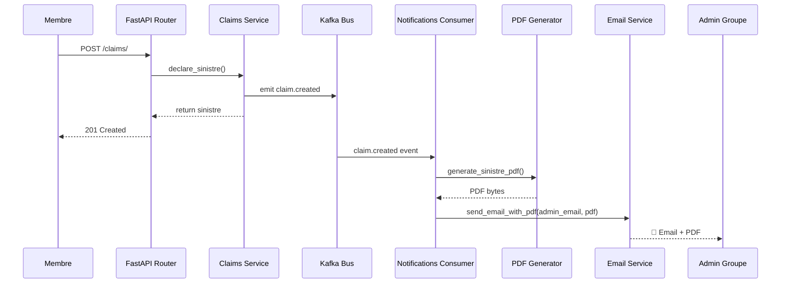

# 📧 Outils pour Email + PDF automatique à la création d'un sinistre

## Contexte de votre projet

| Élément | Technologie |
|---|---|
| Backend | **FastAPI** (Python) |
| BDD | **PostgreSQL** (pgvector) |
| Bus d'événements | **Kafka** (événement `claim.created` déjà en place) |
| Module notifications | Consommateur Kafka existant qui écoute `claim.created` |

> [!IMPORTANT]
> Vous avez déjà l'event Kafka `claim.created` qui est émis dans [events.py](file:///home/ilyass/insurance-platform/backend/app/modules/claims/events.py). Le consommateur dans [notifications/events.py](file:///home/ilyass/insurance-platform/backend/app/modules/notifications/events.py) écoute déjà ce topic. Il suffit d'**étendre** ce consommateur (ou en créer un dédié) pour générer le PDF et envoyer l'email.

---

## 1. 📄 Génération de PDF — 3 options

### Option A : **ReportLab** ⭐ Recommandé

| | |
|---|---|
| Package | `pip install reportlab` |
| Type | Génération PDF programmatique (bas-niveau) |
| Avantages | Contrôle total, léger, très rapide, pas de dépendances externes |
| Idéal pour | Créer des documents structurés (tableaux, logos, en-têtes) |

```python
from reportlab.lib.pagesizes import A4
from reportlab.pdfgen import canvas
from io import BytesIO

def generate_sinistre_pdf(sinistre_data: dict) -> bytes:
    buffer = BytesIO()
    c = canvas.Canvas(buffer, pagesize=A4)
    c.setTitle("Déclaration de Sinistre")
    
    c.drawString(100, 750, f"Sinistre N° {sinistre_data['sinistre_id']}")
    c.drawString(100, 730, f"Montant déclaré : {sinistre_data['montant_declare']} €")
    c.drawString(100, 710, f"Description : {sinistre_data['description']}")
    
    c.save()
    return buffer.getvalue()
```

### Option B : **WeasyPrint**

| | |
|---|---|
| Package | `pip install weasyprint` |
| Type | HTML/CSS → PDF |
| Avantages | Design riche via HTML+CSS, templates Jinja2 réutilisables |
| Inconvénients | Dépendances système (cairo, pango), plus lourd |

```python
from weasyprint import HTML
from jinja2 import Template

def generate_sinistre_pdf(sinistre_data: dict) -> bytes:
    html_template = Template("""
    <html>
    <body>
        <h1>Déclaration de Sinistre</h1>
        <p>N° {{ sinistre_id }}</p>
        <p>Montant : {{ montant_declare }} €</p>
    </body>
    </html>
    """)
    html_content = html_template.render(**sinistre_data)
    return HTML(string=html_content).write_pdf()
```

### Option C : **FPDF2**

| | |
|---|---|
| Package | `pip install fpdf2` |
| Type | Génération PDF simple (haut-niveau) |
| Avantages | API très simple, pur Python, zéro dépendance |
| Inconvénients | Moins flexible que ReportLab pour des layouts complexes |

```python
from fpdf import FPDF

def generate_sinistre_pdf(sinistre_data: dict) -> bytes:
    pdf = FPDF()
    pdf.add_page()
    pdf.set_font("Helvetica", size=16)
    pdf.cell(200, 10, "Déclaration de Sinistre", ln=True, align="C")
    pdf.set_font("Helvetica", size=12)
    pdf.cell(200, 10, f"N° {sinistre_data['sinistre_id']}", ln=True)
    pdf.cell(200, 10, f"Montant : {sinistre_data['montant_declare']} €", ln=True)
    return pdf.output()  # retourne bytes
```

---

## 2. 📬 Envoi d'Email — 3 options

### Option A : **smtplib** (Python standard) ⭐ Recommandé pour commencer

| | |
|---|---|
| Package | Inclus dans Python (rien à installer) |
| Avantages | Zéro dépendance, supporte pièces jointes, SSL/TLS |
| Configuration | Serveur SMTP (Gmail, Outlook, Mailtrap pour les tests) |

```python
import smtplib
from email.mime.multipart import MIMEMultipart
from email.mime.base import MIMEBase
from email.mime.text import MIMEText
from email import encoders

def send_email_with_pdf(
    to_email: str,
    subject: str,
    body: str,
    pdf_bytes: bytes,
    pdf_filename: str = "sinistre.pdf",
):
    msg = MIMEMultipart()
    msg["From"] = "noreply@insurance-platform.com"
    msg["To"] = to_email
    msg["Subject"] = subject

    msg.attach(MIMEText(body, "html"))

    # Pièce jointe PDF
    attachment = MIMEBase("application", "pdf")
    attachment.set_payload(pdf_bytes)
    encoders.encode_base64(attachment)
    attachment.add_header("Content-Disposition", f"attachment; filename={pdf_filename}")
    msg.attach(attachment)

    with smtplib.SMTP_SSL("smtp.gmail.com", 465) as server:
        server.login("votre_email@gmail.com", "app_password")
        server.send_message(msg)
```

### Option B : **FastAPI-Mail**

| | |
|---|---|
| Package | `pip install fastapi-mail` |
| Avantages | Intégration native FastAPI, async, templates Jinja2, pièces jointes |
| Idéal pour | Projets FastAPI avec envoi d'emails fréquent |

```python
from fastapi_mail import FastMail, MessageSchema, ConnectionConfig

conf = ConnectionConfig(
    MAIL_USERNAME="votre_email@gmail.com",
    MAIL_PASSWORD="app_password",
    MAIL_FROM="noreply@insurance-platform.com",
    MAIL_PORT=465,
    MAIL_SERVER="smtp.gmail.com",
    MAIL_STARTTLS=False,
    MAIL_SSL_TLS=True,
)

async def send_sinistre_email(to_email: str, pdf_bytes: bytes):
    message = MessageSchema(
        subject="Nouveau sinistre déclaré",
        recipients=[to_email],
        body="<h1>Nouveau sinistre</h1><p>Voir le PDF en pièce jointe.</p>",
        subtype="html",
        attachments=[{"file": pdf_bytes, "filename": "sinistre.pdf", "type": "application/pdf"}],
    )
    fm = FastMail(conf)
    await fm.send_message(message)
```

### Option C : **Service externe** (SendGrid, Mailgun, AWS SES)

| | |
|---|---|
| Package | `pip install sendgrid` / `pip install mailgun` |
| Avantages | Haute délivrabilité, tracking, templates, scalable |
| Inconvénients | Coût (gratuit jusqu'à un certain volume), dépendance externe |

> [!TIP]
> Pour le **développement/test**, utilisez **Mailtrap** (https://mailtrap.io) — il capture les emails sans les envoyer réellement. Gratuit et très pratique.

---

## 3. 🏗️ Architecture d'intégration recommandée

Voici comment ça s'intègre dans votre architecture existante :



---

## 4. 🎯 Ma recommandation pour votre projet

| Besoin | Outil recommandé | Pourquoi |
|---|---|---|
| **Génération PDF** | **ReportLab** ou **FPDF2** | Léger, pur Python, rapide à mettre en place |
| **Envoi Email** | **smtplib** (stdlib) | Zéro dépendance, suffisant pour votre cas d'usage |
| **Point d'intégration** | **Kafka consumer** (`notifications/events.py`) | Déjà en place, écoute déjà `claim.created` |
| **Test emails** | **Mailtrap** | Capture les emails en dev sans les envoyer |

### Variables d'environnement à ajouter dans `.env` :

```env
# Email SMTP
SMTP_HOST=smtp.gmail.com
SMTP_PORT=465
SMTP_USER=votre_email@gmail.com
SMTP_PASSWORD=votre_app_password
SMTP_FROM=noreply@insurance-platform.com
```

---

## 5. 📦 Résumé des packages à installer

```bash
# PDF (choisir UN seul)
pip install reportlab     # Option A — recommandé
pip install fpdf2         # Option C — plus simple
pip install weasyprint    # Option B — si besoin HTML→PDF (+ deps système)

# Email (optionnel, smtplib est déjà inclus)
pip install fastapi-mail  # Si vous voulez l'intégration FastAPI native
```

> [!NOTE]
> Le combo le plus simple et efficace pour votre projet : **`fpdf2` + `smtplib`** — zéro dépendance lourde, intégration directe dans votre consumer Kafka existant.
