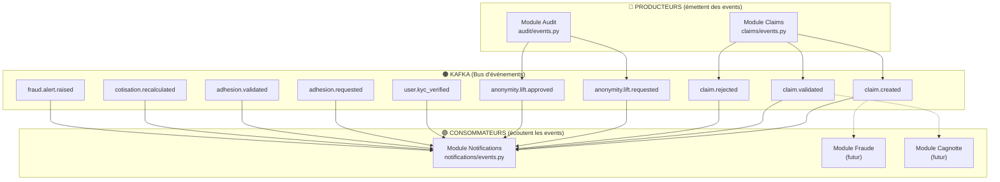
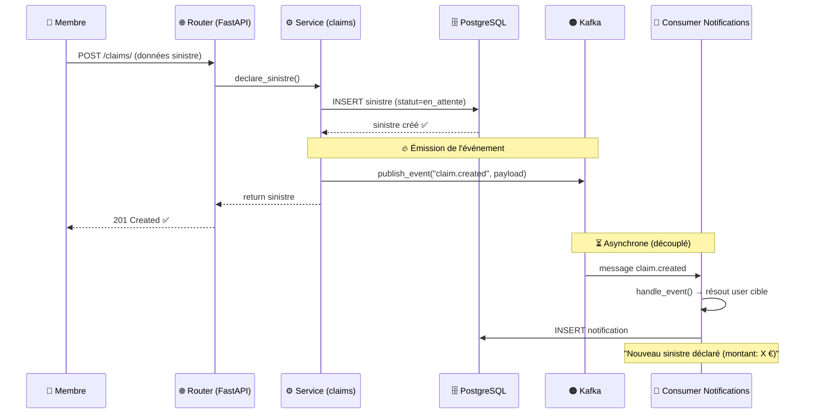

# 🚌 Rôle du bus d'événements Kafka dans le projet

## 1. Qu'est-ce que Kafka fait dans ce projet ?

Kafka joue le rôle de **bus d'événements central** (Event Bus) dans votre plateforme d'assurance P2P. Il permet aux différents modules du backend de **communiquer entre eux de manière découplée** — c'est-à-dire sans se connaître directement.

> [!IMPORTANT]
> **Principe clé** : Quand un module fait une action importante (ex: un sinistre est créé), il **publie un événement** sur Kafka. D'autres modules **écoutent** ces événements et réagissent de manière autonome. C'est l'architecture **Event-Driven**.

### Analogie simple

Imaginez un **tableau d'affichage** dans une entreprise :
- Le module **Claims** affiche un message : *"Un nouveau sinistre a été créé"*
- Le module **Notifications** passe devant, lit le message, et envoie une notification à l'utilisateur
- Le module **Fraude** passe aussi, lit le même message, et lance son analyse
- Chacun agit **indépendamment**, sans que Claims ait besoin de les appeler directement

---

## 2. Architecture globale



---

## 3. Les 3 couches de l'implémentation Kafka

### Couche 1 : Le producteur partagé — [kafka_client.py](file:///home/ilyass/insurance-platform/backend/app/core/kafka_client.py)

C'est le **cœur du système**. Un seul `KafkaProducer` partagé par tous les modules.

```python
# Chaque événement est emballé dans une "enveloppe" standardisée
envelope = {
    "event_id": "uuid-unique",          # ID unique de l'événement
    "event_type": "claim.created",       # Le type (= le topic Kafka)
    "version": "1.0",                    # Version du schéma
    "occurred_at": "2026-07-23T...",     # Horodatage UTC
    "payload": { ... }                   # Les données métier
}
```

> [!NOTE]
> Cette enveloppe garantit que **tous les événements ont le même format**, peu importe le module qui les produit. C'est essentiel pour que les consommateurs puissent les traiter de manière uniforme.

### Couche 2 : Les producteurs par module

Chaque module a son propre fichier `events.py` qui définit les fonctions d'émission :

| Module | Fichier | Events produits |
|---|---|---|
| **Claims** | [claims/events.py](file:///home/ilyass/insurance-platform/backend/app/modules/claims/events.py) | `claim.created`, `claim.validated`, `claim.rejected` |
| **Audit** | [audit/events.py](file:///home/ilyass/insurance-platform/backend/app/modules/audit/events.py) | `anonymity.lift.requested`, `anonymity.lift.approved` |

### Couche 3 : Les consommateurs

Le module **Notifications** est le seul consommateur actif. Il écoute **10 topics** :

| Fichier | [notifications/events.py](file:///home/ilyass/insurance-platform/backend/app/modules/notifications/events.py) |
|---|---|
| Topics écoutés | 10 (tous les events du système) |
| Rôle | Créer des notifications en BDD pour chaque événement |
| Exécution | Worker dédié (thread séparé, pas dans le process FastAPI) |

---

## 4. Flux concret : Que se passe-t-il quand un sinistre est créé ?



**Point clé** : L'API répond immédiatement au membre (`201 Created`). La notification est créée **de manière asynchrone** par le consumer Kafka, sans bloquer la réponse HTTP.

---

## 5. Les 10 topics Kafka du projet

| # | Topic | Producteur | Consommateurs prévus | Rôle |
|---|---|---|---|---|
| 1 | `user.kyc_verified` | Module Users (futur) | Notifications | KYC validé → notifier l'utilisateur |
| 2 | `adhesion.requested` | Module Adhesion (futur) | Notifications | Demande d'adhésion → notifier l'admin groupe |
| 3 | `adhesion.validated` | Module Adhesion (futur) | Notifications | Adhésion traitée → notifier le membre |
| 4 | `cotisation.recalculated` | Module Cotisation (futur) | Notifications | Cotisation recalculée → notifier le membre |
| 5 | `claim.created` | **Claims** ✅ | Notifications, Fraude, Analyseur preuves | Sinistre déclaré → notifier + lancer analyses |
| 6 | `claim.validated` | **Claims** ✅ | Notifications, Cagnotte/Bonus-Malus | **⚠️ Event critique** : déclenche le recalcul du malus |
| 7 | `claim.rejected` | **Claims** ✅ | Notifications | Sinistre rejeté → notifier le membre |
| 8 | `fraud.alert.raised` | Module Fraude (futur) | Notifications | Alerte fraude → notifier l'admin |
| 9 | `anonymity.lift.requested` | **Audit** ✅ | Notifications, Users/KYC | Demande de lever l'anonymat |
| 10 | `anonymity.lift.approved` | **Audit** ✅ | Notifications, Users/KYC, Audit | Anonymat levé → déchiffrer les données |

> [!WARNING]
> L'event `claim.validated` est marqué comme **le plus critique** dans le code. C'est le point d'intégration entre les deux parties du projet (Personne A et Personne B). Quand un sinistre est validé, ça doit déclencher le recalcul du bonus/malus côté Personne A.

---

## 6. Pourquoi Kafka et pas un simple appel de fonction ?

| Approche directe (sans Kafka) | Approche Event-Driven (avec Kafka) |
|---|---|
| `claims/service.py` appelle directement `notifications/service.py` | Claims publie un event, Notifications écoute |
| Si Notifications tombe, Claims plante aussi | Si Notifications tombe, l'event reste dans Kafka et sera traité plus tard |
| Ajouter un nouveau consommateur = modifier Claims | Ajouter un nouveau consommateur = juste écouter le topic |
| Tout est **synchrone** et **couplé** | Tout est **asynchrone** et **découplé** |

### Avantages concrets dans votre projet :

1. **Découplage** — Le module Claims ne sait pas qui écoute ses events. On peut ajouter un module Fraude, un module Email, un module PDF sans toucher au code de Claims.

2. **Fiabilité** — Si le consumer Notifications crashe, les messages sont stockés dans Kafka et seront traités au redémarrage (grâce au `group_id` et à l'offset).

3. **Scalabilité** — On peut lancer plusieurs instances du consumer pour traiter plus de messages en parallèle.

4. **Traçabilité** — Chaque événement a un `event_id` unique et un `occurred_at`, ce qui permet de reconstituer l'historique complet.

---

## 7. Résumé visuel

```
┌─────────────────────────────────────────────────────────┐
│                    VOTRE PROJET                         │
│                                                         │
│   ┌──────────┐     ┌──────────┐     ┌──────────────┐   │
│   │ Claims   │     │  Audit   │     │ (futurs      │   │
│   │ Module   │     │  Module  │     │  modules)    │   │
│   └────┬─────┘     └────┬─────┘     └──────┬───────┘   │
│        │                │                   │           │
│        ▼                ▼                   ▼           │
│   ┌─────────────────────────────────────────────────┐   │
│   │              🟠 KAFKA (Event Bus)               │   │
│   │   Topics: claim.*, anonymity.*, fraud.*, etc.   │   │
│   └──────────────────────┬──────────────────────────┘   │
│                          │                              │
│        ┌─────────────────┼──────────────────┐           │
│        ▼                 ▼                  ▼           │
│   ┌──────────┐     ┌──────────┐     ┌──────────────┐   │
│   │ Notifs   │     │ Fraude   │     │ Cagnotte/    │   │
│   │ Consumer │     │ (futur)  │     │ Malus (futur)│   │
│   └──────────┘     └──────────┘     └──────────────┘   │
│                                                         │
└─────────────────────────────────────────────────────────┘
```

Kafka est le **système nerveux** de votre plateforme : il transporte l'information entre les modules sans qu'ils aient besoin de se connaître.
